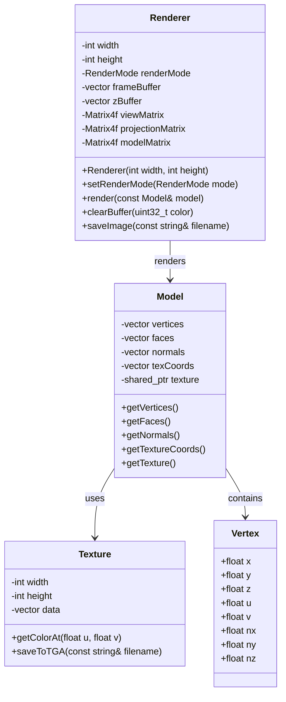

# Software Renderer - Developer Guide

## Table of Contents
1. [Architecture Overview](#architecture-overview)
2. [Class Diagram](#class-diagram)
3. [Core Components](#core-components)
4. [Extending the Renderer](#extending-the-renderer)
5. [API Reference](#api-reference)
6. [Build System](#build-system)
7. [Testing](#testing)
8. [Contributing](#contributing)

## Architecture Overview

The Software Renderer is built with a modular architecture that separates concerns into distinct components. The main components are:

- **Renderer**: Core rendering engine
- **Model**: 3D model representation
- **Texture**: Texture management
- **Camera**: View and projection management

## Class Diagram



## Core Components

### Renderer Class

The `Renderer` class is the main component that handles all rendering operations. It supports multiple rendering modes and manages the frame buffer and depth buffer.

Key features:
- Multiple rendering modes (wireframe, solid, textured, shaded, colorful)
- Depth buffer for proper 3D rendering
- Camera and projection management
- Frame buffer operations

### Model Class

The `Model` class represents a 3D model with its geometry, textures, and materials.

Key features:
- Vertex management
- Face definitions
- Normal vectors
- Texture coordinates
- Material properties

### Texture Class

The `Texture` class handles texture loading, storage, and sampling.

Key features:
- TGA file format support
- UV coordinate sampling
- Mipmapping (planned)
- Texture filtering

## Extending the Renderer

### Adding New Rendering Modes

1. Add a new mode to the `RenderMode` enum
2. Implement the rendering function in the `Renderer` class
3. Add the mode to the render mode selection logic

Example:
```cpp
enum class RenderMode {
    WIREFRAME,
    SOLID,
    TEXTURED,
    TEXTURED_SHADED,
    COLORFUL,
    YOUR_NEW_MODE  // Add your mode here
};
```

### Adding New Features

1. **New Shading Models**
   - Implement new shading functions
   - Add to the appropriate rendering mode

2. **New Texture Features**
   - Extend the Texture class
   - Implement new sampling methods

3. **New Geometry Features**
   - Add new vertex attributes
   - Implement new geometry processing

### Rendering Mode Implementations

1. **Wireframe Mode**
   - Implementation: `void Renderer::renderWireframe(const Model& model)`
   - Renders only the edges of triangles
   - Does not use z-buffer

2. **Solid Mode**
   - Implementation: `void Renderer::renderSolid(const Model& model)`
   - Fills triangles with shaded colors based on lighting
   - Uses basic z-buffer for depth testing

3. **Textured Mode**
   - Implementation: `void Renderer::renderTextured(const Model& model)`
   - Maps texture coordinates to triangle surfaces
   - Includes z-buffer for proper depth handling

4. **Textured Shaded Mode**
   - Implementation: `void Renderer::renderTexturedShaded(const Model& model)`
   - Combines textures with per-vertex lighting
   - Advanced z-buffer implementation with proper interpolation

5. **Colorful Mode**
   - Implementation: `void Renderer::renderColorful(const Model& model)`
   - Assigns random colors to each triangle
   - Uses z-buffer for proper depth handling
   - Implements backface culling to improve rendering efficiency
   - Helpful for visualization and debugging of model geometry

## API Reference

### Renderer API

```cpp
class Renderer {
public:
    // Constructor
    Renderer(int width, int height);

    // Rendering modes
    void setRenderMode(RenderMode mode);
    void render(const Model& model);

    // Camera control
    void setCameraPosition(const Vector3f& position);
    void setCameraTarget(const Vector3f& target);

    // Buffer management
    void clearBuffer(uint32_t color);
    bool saveImage(const string& filename);
};
```

### Model API

```cpp
class Model {
public:
    // Geometry access
    const vector<Vector3f>& getVertices() const;
    const vector<Face>& getFaces() const;
    const vector<Vector3f>& getNormals() const;
    const vector<Vector2f>& getTextureCoords() const;
    shared_ptr<Texture> getTexture() const;
};
```

### Helper Methods

The renderer implements several helper methods for different rendering techniques:

```cpp
// Triangle drawing with z-buffer support
void drawTriangle(Vertex v0, Vertex v1, Vertex v2, uint32_t color);

// Scanline rasterization with z-buffer
void drawScanline(
    int yStart, int yEnd,
    float xLeft, float dxLeft, float xRight, float dxRight,
    float zLeft, float dzLeft, float zRight, float dzRight,
    uint32_t color);

// Random color generation for colorful rendering mode
uint32_t generateRandomColor();
```

## Build System

The project uses CMake for build configuration. Key build files:

- `CMakeLists.txt`: Main build configuration
- `build_windows.bat`: Windows build script

### Building from Source

1. **Prerequisites**
   - CMake 3.10+
   - Visual Studio 2022
   - C++17 compiler

2. **Build Steps**
   ```batch
   scripts\build_windows.bat build
   ```

3. **Development Build**
   ```batch
   scripts\build_windows.bat rebuild
   ```

## Testing

### Unit Tests

The project includes unit tests for core functionality. Run tests using:

```batch
scripts\build_windows.bat test
```

### Test Coverage

- Geometry processing
- Rendering modes
- Texture sampling
- Camera operations

## Contributing

### Code Style

- Follow the existing code style
- Use meaningful variable names
- Add comments for complex operations
- Document public APIs

### Pull Request Process

1. Create a feature branch
2. Implement changes
3. Add tests
4. Update documentation
5. Submit pull request

### Development Workflow

1. **Setup**
   ```batch
   git clone [repository]
   cd software-renderer
   scripts\build_windows.bat build
   ```

2. **Development**
   - Make changes
   - Build and test
   - Update documentation

3. **Testing**
   - Run unit tests
   - Verify rendering output
   - Check performance

4. **Documentation**
   - Update API documentation
   - Add usage examples
   - Update class diagrams 