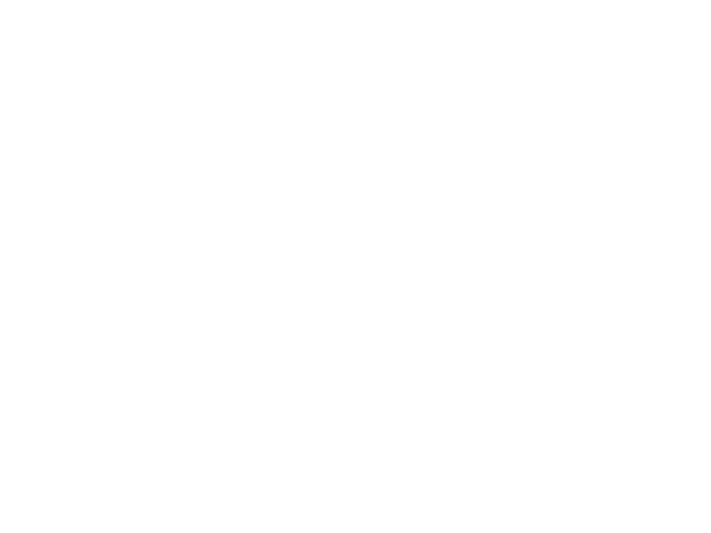
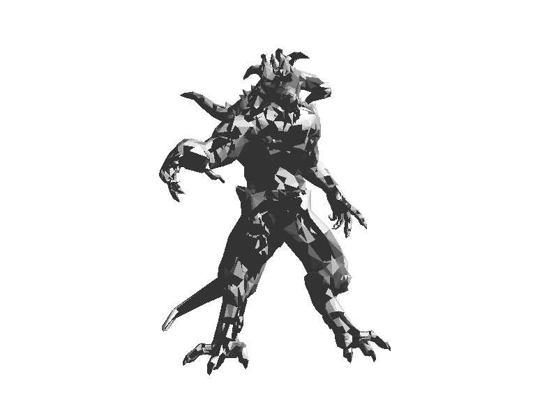
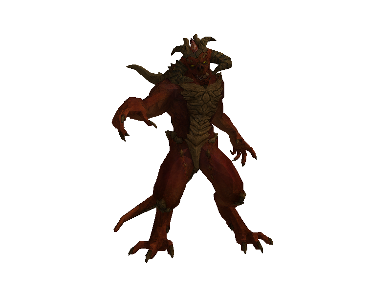
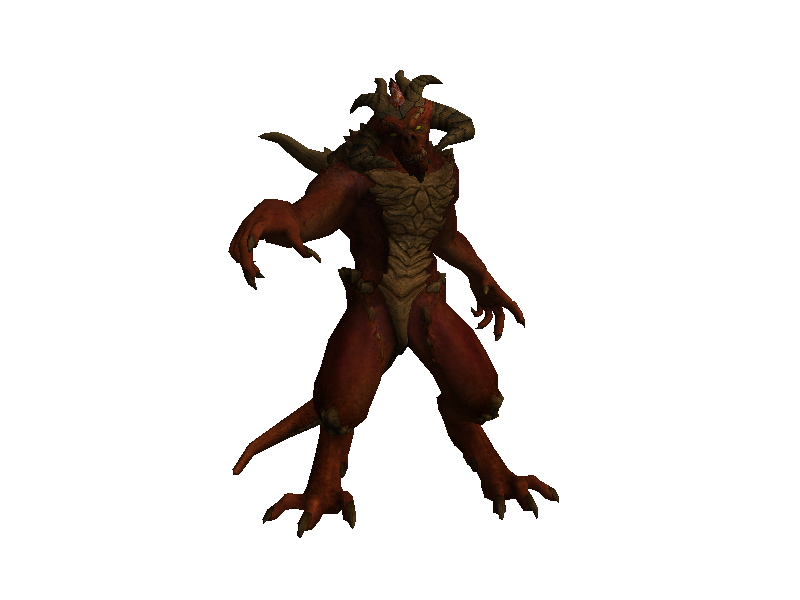
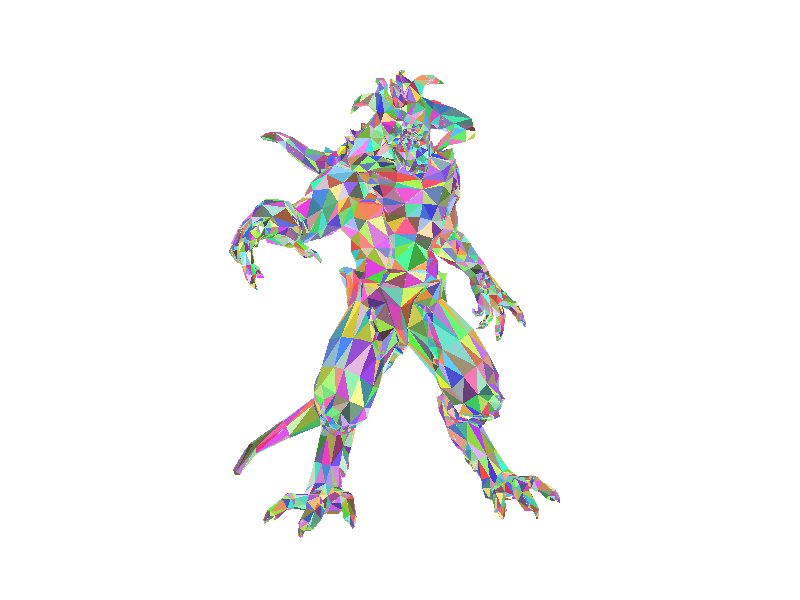

# Software Renderer - User Guide

## Table of Contents
1. [Introduction](#introduction)
2. [Installation](#installation)
3. [Getting Started](#getting-started)
4. [Features](#features)
5. [Usage Examples](#usage-examples)
6. [Troubleshooting](#troubleshooting)

## Introduction

Software Renderer is a 3D rendering application that allows you to render 3D models with various rendering modes. It supports wireframe, solid, textured, and shaded rendering, making it suitable for both educational and practical 3D visualization purposes.

## Installation

### System Requirements
- **Hardware Requirements**:
  - CPU: Any modern dual-core processor (1.6 GHz or higher)
  - RAM: 2GB (minimum), 4GB (recommended)
  - GPU: Any GPU or integrated graphics
  - Storage: 50MB free space
- **Windows Requirements**:
  - Windows 10 or newer
  - Visual Studio 2022 with C++ Build Tools
  - CMake 3.10 or higher
- **Linux Requirements**:
  - Ubuntu 20.04+, Fedora 33+, or equivalent
  - GCC 9.0+ or Clang 10.0+
  - CMake 3.10 or higher
  - Make or Ninja build system

### Installation Steps

#### Windows

1. **Download the Software**
   - Clone the repository or download the source code

2. **Build the Application**
   ```batch
   scripts\build_windows.bat build
   ```
   This will create the executable in `build\Release\software-renderer.exe`

3. **Verify Installation**
   - Navigate to `build\Release`
   - Run `software-renderer.exe` to verify the installation

#### Linux

1. **Download the Software**
   - Clone the repository or download the source code

2. **Build the Application with Make**
   ```bash
   # Create build directory
   mkdir -p build && cd build
   
   # Configure with CMake
   cmake ..
   
   # Build the project
   make -j$(nproc)
   ```
   This will create the executable `software-renderer` in the `build` directory.

3. **Alternative: Build with Ninja (faster)**
   ```bash
   # Install Ninja if needed
   # sudo apt-get install ninja-build   # Debian/Ubuntu
   # sudo dnf install ninja-build       # Fedora
   
   # Create build directory
   mkdir -p build && cd build
   
   # Configure with Ninja
   cmake -G Ninja ..
   
   # Build the project
   ninja
   ```

4. **Verify Installation**
   - In the `build` directory
   - Run `./software-renderer` to verify the installation

## Getting Started

### Basic Usage

1. **Launch the Application**
   ```batch
   # Windows
   cd build\Release
   software-renderer.exe
   
   # Linux
   cd build
   ./software-renderer
   ```

2. **Load a 3D Model**
   - The application supports standard 3D model formats
   - Use the command line to specify input files:
   ```batch
   # Windows
   software-renderer.exe --input model.obj
   
   # Linux
   ./software-renderer --input model.obj
   ```

3. **Choose Rendering Mode**
   The renderer supports several modes:
   - Wireframe: Shows model edges
   - Solid: Filled triangles with basic shading
   - Textured: Applies textures to the model
   - Textured Shaded: Combines textures with lighting
   - Colorful: Random colors for visualization

### Application Interface

When the application is successfully launched and a model is loaded, you will see a render of your 3D model in the specified mode. The application outputs a rendered image to the specified file.

*Figure 1: Wireframe Mode - The model is displayed as a wireframe showing only edges and vertices*


*Figure 2: Solid Mode - The model with basic diffuse lighting applied*


*Figure 3: Textured Mode - The model with textures applied for a more realistic appearance*


*Figure 4: Shaded Mode - Lighting is applied to the textured model creating depth and shadows*


*Figure 5: Colorful Mode - Each face is assigned a random color, useful for visualization and debugging*



**Note:** The application is command-line based and doesn't feature a graphical user interface. The rendered output is saved as an tga file that you can view using an tga image viewer.

## Features

### Rendering Modes

1. **Wireframe Mode**
   - Displays the model's wireframe structure
   - Useful for debugging and understanding model topology
   - Fast rendering for quick previews

2. **Solid Mode**
   - Fills triangles with solid colors
   - Includes basic diffuse lighting
   - Good for quick visualization

3. **Textured Mode**
   - Applies textures to the model
   - Supports UV mapping
   - Realistic surface appearance

4. **Textured Shaded Mode**
   - Combines textures with lighting
   - Supports normal mapping
   - Most realistic appearance

5. **Colorful Mode**
   - Assigns random colors to faces
   - Useful for debugging and visualization
   - Helps identify individual faces
   - Uses z-buffer for proper depth handling between triangles
   - Efficiently visualizes complex 3D models with correct occlusion

### Camera Controls

The renderer provides camera controls to view your model from different angles:
- Position: Adjust camera position
- Target: Set the point the camera looks at
- Up Vector: Define the camera's orientation

## Usage Examples

### Basic Rendering
```batch
# Windows
software-renderer.exe --input model.obj --mode wireframe

# Linux
./software-renderer --input model.obj --mode wireframe
```

### Textured Rendering
```batch
# Windows
software-renderer.exe --input model.obj --mode textured --texture texture.tga

# Linux
./software-renderer --input model.obj --mode textured --texture texture.tga
```

### Colorful Rendering
```batch
# Windows
software-renderer.exe --input model.obj --mode colorful

# Linux
./software-renderer --input model.obj --mode colorful
```

### Saving Output
```batch
# Windows
software-renderer.exe --input model.obj --output render.tga

# Linux
./software-renderer --input model.obj --output render.tga
```

### Advanced Examples

1. **Complete Rendering with Camera Control**
```batch
# Windows
.\build\Release\software-renderer.exe --input examples\diablo3_pose\diablo3_pose.obj --output diablo_shaded.tga --texture examples\diablo3_pose\diablo3_pose_diffuse.tga --mode shaded --camera-x 0 --camera-y 0 --camera-z 3

# Linux
./build/software-renderer --input examples/diablo3_pose/diablo3_pose.obj --output diablo_shaded.tga --texture examples/diablo3_pose/diablo3_pose_diffuse.tga --mode shaded --camera-x 0 --camera-y 0 --camera-z 3
```

2. **Custom Resolution with Different Rendering Mode**
```batch
# Windows
.\build\Release\software-renderer.exe --input model.obj --output highres.tga --width 1920 --height 1080 --mode shaded --texture texture.tga --camera-x 2 --camera-y 1 --camera-z 4

# Linux
./build/software-renderer --input model.obj --output highres.tga --width 1920 --height 1080 --mode shaded --texture texture.tga --camera-x 2 --camera-y 1 --camera-z 4
```

3. **Debug Visualization with Colorful Mode**
```batch
# Windows
.\build\Release\software-renderer.exe --input complex_model.obj --output debug_view.tga --mode colorful --width 800 --height 600 --camera-x 0 --camera-y 0 --camera-z 5

# Linux
./build/software-renderer --input complex_model.obj --output debug_view.tga --mode colorful --width 800 --height 600 --camera-x 0 --camera-y 0 --camera-z 5
```

4. **Wireframe Analysis with Custom Camera Position**
```batch
# Windows
.\build\Release\software-renderer.exe --input model.obj --output wireframe_analysis.tga --mode wireframe --camera-x 1.5 --camera-y 0.5 --camera-z 2.5

# Linux
./build/software-renderer --input model.obj --output wireframe_analysis.tga --mode wireframe --camera-x 1.5 --camera-y 0.5 --camera-z 2.5
```

### Command Line Options Reference

| Option | Description | Example |
|--------|-------------|---------|
| `--input` | Input OBJ model file | `--input model.obj` |
| `--output` | Output TGA image file | `--output render.tga` |
| `--texture` | Texture file (TGA format) | `--texture texture.tga` |
| `--mode` | Rendering mode | `--mode shaded` |
| `--width` | Output image width | `--width 1920` |
| `--height` | Output image height | `--height 1080` |
| `--camera-x` | Camera X position | `--camera-x 0` |
| `--camera-y` | Camera Y position | `--camera-y 0` |
| `--camera-z` | Camera Z position | `--camera-z 3` |

Available rendering modes:
- `wireframe`: Shows model edges
- `solid`: Filled triangles with basic shading
- `textured`: Applies textures to the model
- `shaded`: Combines textures with lighting
- `colorful`: Random colors for visualization

## Troubleshooting

### Common Issues

1. **Application Won't Start**
   - **Windows**: 
     - Verify Visual Studio 2022 and C++ Build Tools are installed
     - Check if the executable exists in build\Release
     - Run as administrator if permission issues occur
   - **Linux**:
     - Verify required dependencies are installed (GCC/Clang, CMake)
     - Check if the executable has proper permissions (`chmod +x software-renderer`)
     - Verify shared libraries are available (`ldd software-renderer`)

2. **Model Not Loading**
   - Verify the model file exists
   - Check if the model format is supported
   - Ensure the model file is not corrupted
   - **Linux**: Remember to use forward slashes in file paths (`--input examples/model.obj`)

3. **Rendering Issues**
   - Check if textures are in the correct format (TGA)
   - Verify model has proper UV coordinates for textured modes
   - Ensure model has proper normals for shaded modes

### Common Error Messages

1. **"Failed to open model file: [filename]"**
   - **Cause**: The specified model file cannot be found or accessed
   - **Solution**: 
     - Check if the file path is correct
     - Verify the file exists in the specified location
     - Ensure you have read permissions for the file
     - On Windows, use backslashes (`\`) in paths
     - On Linux, use forward slashes (`/`) in paths

2. **"Failed to open texture file: [filename]"**
   - **Cause**: The specified texture file cannot be found or accessed
   - **Solution**:
     - Verify the texture file exists
     - Check if the texture is in TGA format
     - Ensure the texture file is not corrupted
     - Make sure the texture path is correct relative to the executable

3. **"Failed to save image: [filename]"**
   - **Cause**: Cannot write to the specified output location
   - **Solution**:
     - Check if you have write permissions in the target directory
     - Ensure the target directory exists
     - Verify there's enough disk space
     - Make sure the filename is valid

4. **"Invalid rendering mode: [mode]"**
   - **Cause**: The specified rendering mode is not supported
   - **Solution**:
     - Use one of the supported modes: `wireframe`, `solid`, `textured`, `shaded`, or `colorful`
     - Check for typos in the mode name
     - Ensure the mode name is in lowercase

5. **"Model has no texture coordinates"**
   - **Cause**: Trying to use textured or shaded mode with a model that lacks UV coordinates
   - **Solution**:
     - Use a different rendering mode (wireframe, solid, or colorful)
     - Export the model with UV coordinates from your 3D modeling software
     - Check if the model file is properly formatted

6. **"Model has no normals"**
   - **Cause**: Trying to use shaded mode with a model that lacks normal vectors
   - **Solution**:
     - Use a different rendering mode
     - Export the model with normals from your 3D modeling software
     - Check if the model file is properly formatted

7. **"Invalid camera position"**
   - **Cause**: Camera position values are out of reasonable range
   - **Solution**:
     - Use values between -10 and 10 for camera positions
     - Ensure the camera is not too close to or inside the model
     - Try different camera positions to find a good viewing angle

8. **"Invalid image dimensions"**
   - **Cause**: Specified width or height is invalid
   - **Solution**:
     - Use positive values for width and height
     - Keep dimensions reasonable (e.g., 100-4096 pixels)
     - Ensure the total image size doesn't exceed available memory

### Getting Help

If you encounter issues not covered in this guide:
1. Check the error messages in the console output
2. Review the logs in the `logs` directory
3. Consult the developer documentation for technical details 